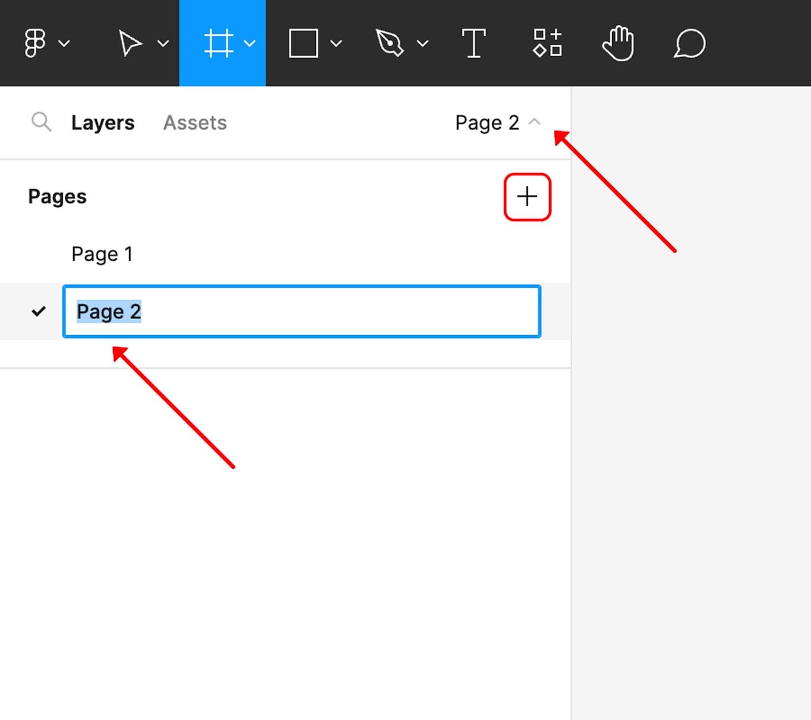
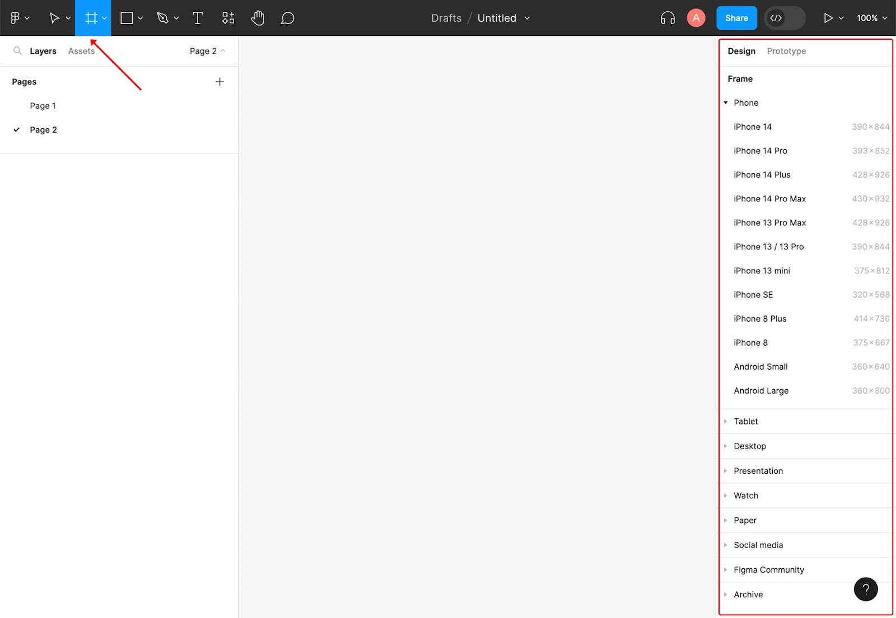
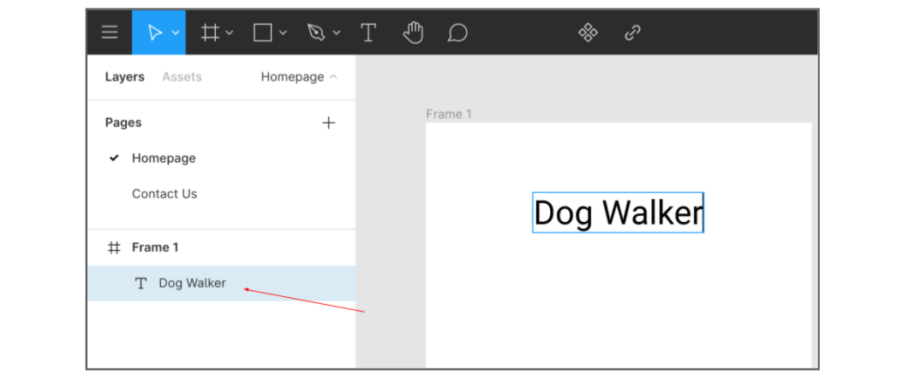
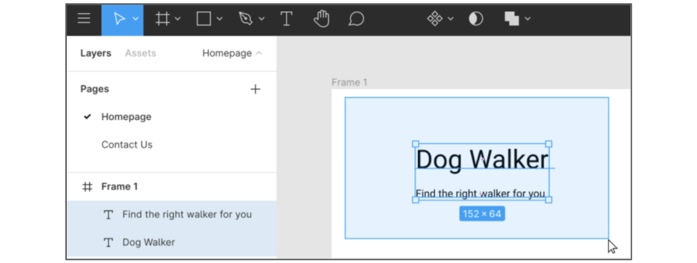
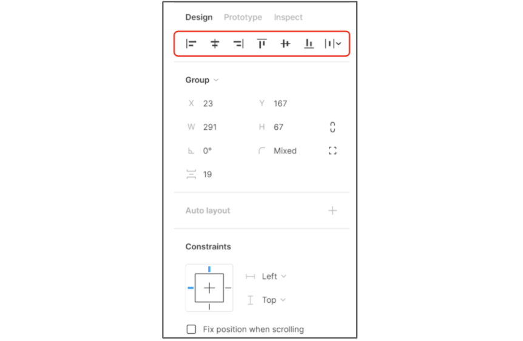
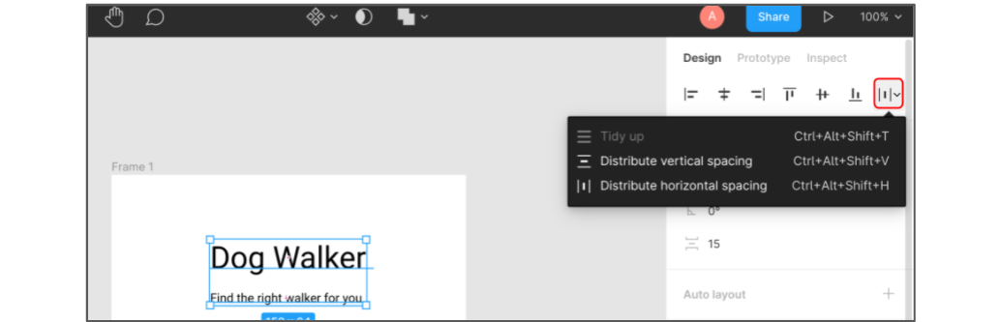
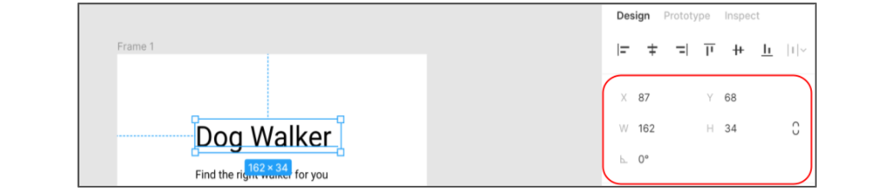
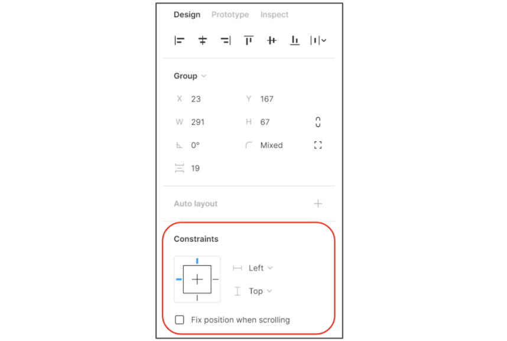

## Foundational skills to build mockups in Figma

You’re almost ready to create your very first mockup in Figma. Before you get started, let’s explore some of the skills that will give you the basic foundation to confidently create mockups in Figma. 

- Create a new **page**.

- Create frames on the **canvas**.

- Tab between projects in Figma.

### Names to know
Before you can begin creating a mockup, it’s important to understand the names that are used in Figma.

- Each document is called a **file**. 

- A **file** contains the **canvas**, where you’ll create layers and objects for your designs. 

- A **file** also contains **pages**, where you’ll design your screens. 

- Each **page** has its own **canvas**. This **canvas** is gray (#E5E5E5) by default and is where you can add, remove, and update your designs. 

### Create a new page
It’s easy to create a new page in Figma by following these simple steps:

1. Log in to Figma.

2. Create a new **Design file** by clicking the + icon in the upper-right corner.

3. On the left, click **Page 1**. This lists all of the pages currently in your **file**.

4. Click the + icon to add a new **page** to your file, as shown in the image below. 

5. When you create a new **page**, you’ll immediately be able to rename it. Or, you can rename a page at any time by double-clicking the title of the **page**. When you begin to name a page, the name text will be highlighted in blue and the row will be outlined in blue, as shown in the image below.

### Create frames
The canvas in Figma is where you’ll create **frames**. You can think of the **canvas** like a blank wall that a picture **frame** hangs on, and the frames are like picture frames where you’ll design.

To create a new **frame**: Select the **frame** tool. The icon has four lines crossing in a grid pattern. It’s listed as the third icon from the left in the toolbar. The image below shows the frame icon in the Figma toolbar.

There are a few ways to choose the size of the frame:

Click inside the **canvas** to create a default **frame**. The dimensions for default frames are 100x100 pixels. 

Click and drag in the **canvas** to create a **frame** with the dimensions you prefer. When you click and drag, the width and height will automatically update based on how much you drag. If you want to choose a specific width and height, you can do this in the **frame** section in the **design** panel on the right side of the screen.

Select a predetermined size for a frame, like a specific phone model or tablet, in the **Design** panel on the right side of the screen. As shown in the image below, there is a list of different containers or **frames** for various devices or formats. Simply select a size to add the **frame** to your **canvas**.

## Work with type in mockups

You've started to learn about what's involved in adding typography to your designs, like picking a typeface and choosing a font. By now, you know that type is an important design choice. When typography complements a design’s personality and style, it helps convey a brand's identity, values, and mission. It can also add emphasis to parts of your design, which helps users find and interpret the information they need. 

In this reading, you will learn the basics of working with typography in Figma. You’ll create and select text fields, adjust fonts and font sizes, reorganize text, and set and save configured fonts. There are lots of cool features to explore when it comes to adding type to your designs in Figma, so let’s go! 

### Create text fields 
Before making choices about typography, you’ll need to create a text field in Figma:

1. Open your file in Figma.

2. Select the Text icon in the toolbar, which looks like a letter T (highlighted in blue in the image below).

3. Click anywhere on the Canvas and start typing to enter text. 

Select and edit text fields
To edit or adjust your text, you must first select the text box. When there is only one text box in your Canvas, you can select it with a single click. But when there are multiple boxes, you will need to select the correct layer. To select a text box:

1. Click the text you want to edit in the **Layers** panel (on the left side of the screen). The selected text layer will be highlighted in blue in the Layers panel, as shown in the image below.

2. Double-click the text in the box you selected on the Canvas. Or, to select all the text in a box, press enter (or return).

3. Make changes to the text as needed

To select more than one text box, first choose the **Move** tool (highlighted in the upper toolbar of the image below). Then, find an empty space on your canvas and click and drag a selection box over the text boxes you want to edit. All the text in this selection box will be highlighted in blue in the **Layers** panel, as shown below.

Adjust fonts and font sizes
Once you’ve selected a text box, you're ready to make design choices! You can adjust text properties like font size and weight (the thickness of your font). To adjust your font:

1. First, select a text box using the steps in the previous section.

2. Then, find the **Text** section of the **Design** panel (on the right side of the screen).

3. To find a typeface or font family, click the **Font** dropdown. From here you can browse a list of web, local, and shared fonts.

4. You can choose a weight from the **Weight** dropdown.

5. To change the size of the text using the **Size** dropdown, or manually enter a size in the size field. 

From the **Text** menu, you can also change properties like paragraph spacing, line height, alignment, and more.

### Reorganize text
You can adjust the alignment, size, location, or constraints of your text in the **Design** panel. Let’s break down the sections of this panel:

### Alignment
The alignment options are located at the top of the **Design** panel. Alignment determines how text and other design elements are distributed inside the boundary box. Once you’ve selected a text box, you can choose from the following alignment options in the menu bar:

- Align left

- Align horizontal center

- Align right

- Align top 

- Align vertical center

- Align bottom 

- Distribute

If you’ve selected multiple text boxes, you can click the dropdown menu, (as shown below), to choose from three more alignment options:

- Tidy up: Distribute the selected elements evenly in all directions

- Distribute vertical spacing: Space selected elements evenly across the height of the frame

- Distribute horizontal spacing: Space selected elements evenly across the width of the frame

### Location and size
The numbers below the alignment options correspond to a selected element’s position on the Canvas. By changing these numbers, you can move an element along the frame’s X axis (left and right) and the Y axis (up and down).   

You can adjust an element’s width and height using the W and H values. Keep in mind that these values only change the size of the selected text box, not the font. Changing the W and H values can be handy when you’ve resized your text and want to change the size of the box to match.

### Constraints
Constraints limit where an element can be placed within a Frame. They are helpful when you need to maintain a specific distance from the edge of the canvas and for designing on different devices.

Each element has horizontal and vertical constraints. The **horizontal constraints** dictate how close the element can get to along the left or right edge of the frame. The **vertical constraints** determine how close it can get to the  top or bottom edge. You can also decide on how to center the element on the X or Y axis. If you need to resize the frame, you can also set the **scale** of an element so that it  remains in proportion to the resized frame.

### Set and save preconfigured fonts
As you get more comfortable with Figma, you can save time by saving a text style and reusing it across different designs:

1. In the **Layers** panel, select the text with the properties you want to save and reuse.

2. Go to the **Text** header in the **Design** panel. Then, click the **Style** icon (represented by four dots in the shape of a square).

3. The **Text Styles** will appear. Click the **Plus** (+) icon in the top right corner of this menu to name your style.

4. Once you’ve picked a name, click **Create Style**. And that's it! You've saved a text style to reuse again in your designs. To use a text style you've saved, select the text you want to edit in the **Layers** panel. Then return to the **Text Styles** menu to select the style you created from the list.:

